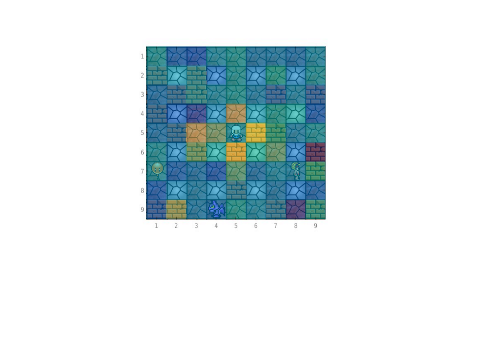

# The Bot in Use

## Progress
The bot is now able to search for and destroy bricks, run away from bombs, and dispatch enemies with varying degrees of success. Through training on user data, it now is able to better handle the beginning level. As seen below it actively will eliminate monsters and will destroy bricks.

## Video

  <iframe width="630" height="475" src="https://www.youtube.com/embed/jZx58VJvCrI" frameborder="0" allowfullscreen></iframe>

## Visualization of Machine learning

Below shows a visualization of the weight of the surroundings for the player. These weights are specific for the walls Neural Net. As expected the nodes closer to the player have a higher weight and are therefore more influential than the nodes farther away.

