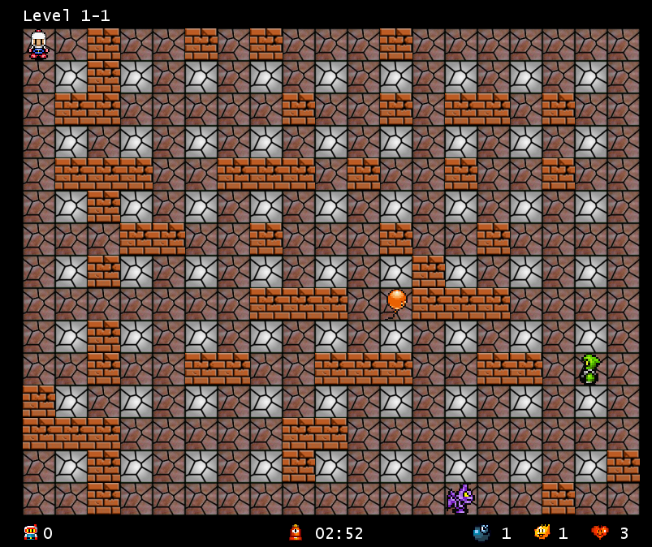

# The Bomberman Bot
Our Bomberman Bot is a neural net taught program that plays the classic arcade game, Bomberman. From saving the gameplay of our team, along with some hardcoded AI sessions, we fed the neural net this training data to recognize the most likely correct command to use.

We took this project on as we all love video games and all took an interest in machine learning. Being most of our team members' first venture into machine learning, we wanted to tackle a project we all knew we'd be invested in.

## Authors 
<a href="https://github.com/Ryofashadewalk">Alex Core</a> 
<a href="https://github.com/zneb97">Benjamin Ziemann</a> 
<a href="https://github.com/CleanestMink126">Nick Steelman</a> 
<a href="https://github.com/SeunginLyu">Seungin Lyu</a> 
<a href="https://github.com/yjiang0929">Yichen Jiang</a> 
All of us were first years at Franklin W. Olin College of Engineering at the time of this project's start and end.

Base game code written by Github user <a href="https://github.com/rickyc/bomberman-pygame">rickyc.</a> 

## Project Reviews and Work 

Project proposal can be found <a href="https://github.com/zneb97/SoftDesFinalProject/blob/master/ProjectProposal.md">here.</a> 
Architectural Review can be found <a href="https://github.com/zneb97/SoftDesFinalProject/blob/master/ArchitecturalReview.md">here.</a>
 
Architectural Review Reflection can be found <a href="https://github.com/zneb97/SoftDesFinalProject/blob/master/ReflectionSynthesis.md">here.</a>

## License 
MIT License

Copyright (c) [2017] [Alex Core, Benjamin Ziemann, Nick Steelman, Seungin Lyu, Yichen Jiang]

Permission is hereby granted, free of charge, to any person obtaining a copy
of this software and associated documentation files (the "Software"), to deal
in the Software without restriction, including without limitation the rights
to use, copy, modify, merge, publish, distribute, sublicense, and/or sell
copies of the Software, and to permit persons to whom the Software is
furnished to do so, subject to the following conditions:

The above copyright notice and this permission notice shall be included in all
copies or substantial portions of the Software.

THE SOFTWARE IS PROVIDED "AS IS", WITHOUT WARRANTY OF ANY KIND, EXPRESS OR
IMPLIED, INCLUDING BUT NOT LIMITED TO THE WARRANTIES OF MERCHANTABILITY,
FITNESS FOR A PARTICULAR PURPOSE AND NONINFRINGEMENT. IN NO EVENT SHALL THE
AUTHORS OR COPYRIGHT HOLDERS BE LIABLE FOR ANY CLAIM, DAMAGES OR OTHER
LIABILITY, WHETHER IN AN ACTION OF CONTRACT, TORT OR OTHERWISE, ARISING FROM,
OUT OF OR IN CONNECTION WITH THE SOFTWARE OR THE USE OR OTHER DEALINGS IN THE
SOFTWARE.
